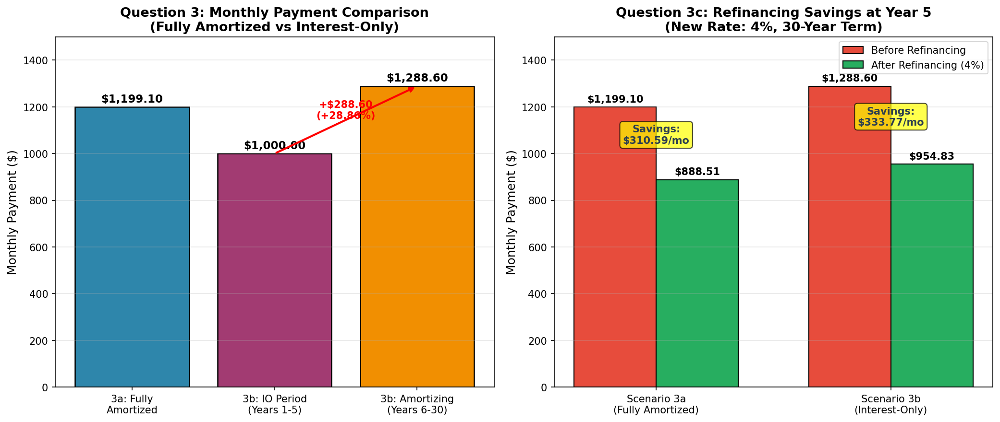
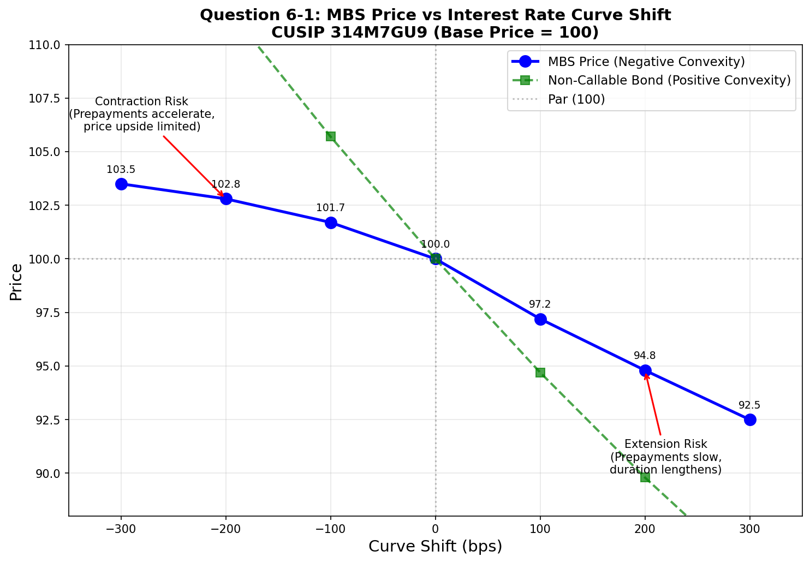

# Real Estate Capital Market Analysis

## In-Class Mid-Term Exam Answers - March 4, 2026

---

## Question 1: Scheduled Balances at End of Year 5 (10 points)

**Method:** The scheduled balance of a fixed-rate mortgage at any time equals the present value of the remaining payments discounted by the mortgage rate.

**Formula:**

- Monthly Payment: $PMT = P \times \frac{r(1+r)^n}{(1+r)^n - 1}$
- Balance at month t: $Balance_t = PMT \times \frac{1-(1+r)^{-(n-t)}}{r}$

### Mortgage A: $100,000 at 8%

- Monthly rate: $r = 0.08/12 = 0.00667$
- Monthly payment: **$733.76**
- Balance at end of year 5 (month 60): **$95,069.86**

### Mortgage B: $90,000 at 7%

- Monthly rate: $r = 0.07/12 = 0.00583$
- Monthly payment: **$598.77**
- Balance at end of year 5 (month 60): **$84,718.43**

---

## Question 2: 15-Year Mortgage with Discount Points (20 points)

**Loan Terms:** $200,000, 15-year, 6% with 2 discount points

### 2a. Monthly Payment (5 points)

Using the standard mortgage payment formula:
$$PMT = 200,000 \times \frac{0.005(1.005)^{180}}{(1.005)^{180} - 1}$$

**Answer: $1,687.71**

### 2b. APR (5 points)

- Net proceeds after 2 points: $200,000 × (1 - 0.02) = **$196,000**
- APR is the rate that equates net proceeds to PV of all payments
- Using IRR calculation over 180 months

**Answer: 6.3170%**

### 2c. Effective Cost if Repaid at Year 5 (10 points)

- Balance at end of year 5: **$152,018.20**
- Cash flows: Receive $196,000 at t=0, pay $1,687.71 for 60 months, pay balance at month 60
- Effective cost = IRR of these cash flows × 12

**Answer: 6.5253%**

_Note: The effective cost increases when the loan is repaid early because the upfront points are amortized over a shorter period._

---

## Question 3: Mortgage Monthly Payment Calculations (20 points)

### 3a. 30-Year Fully Amortized Mortgage (5 points)

**Terms:** $200,000, 6.00%, 30 years

$$PMT = 200,000 \times \frac{0.005(1.005)^{360}}{(1.005)^{360} - 1}$$

**Answer: $1,199.10**

### 3b. Interest-Only Mortgage (5 points)

**Terms:** $200,000, 6.00%, interest-only for 5 years, then 25-year amortization

**Interest-only payment (first 5 years):**
$$PMT_{IO} = 200,000 \times 0.005 = \textbf{\$1,000.00}$$

**Amortizing payment (remaining 25 years):**
$$PMT = 200,000 \times \frac{0.005(1.005)^{300}}{(1.005)^{300} - 1} = \textbf{\$1,288.60}$$

**Payment increase:**

- Dollar increase: **$288.60**
- Percentage increase: **28.86%**

### 3c. Refinancing at 4% after 5 Years

**From Scenario 3a:**

- Balance at end of year 5: **$186,108.71**
- New payment after refinancing (30-year at 4%): **$888.51**
- **Monthly savings: $310.59**

**From Scenario 3b:**

- Balance at end of year 5: **$200,000.00** (no principal paid during IO period)
- New payment after refinancing (30-year at 4%): **$954.83**
- **Monthly savings: $333.77**

_Note: The IO loan has higher savings in absolute dollars because it refinances a larger balance at the lower rate._

---

## Question 4: Interest Rate Risk of Mortgage Loan (20 points)

**Original Loan:** 30-year FRM, $100,000, 8%, purchased at par

- Monthly payment: **$733.76**

### 4-1a. Rate Increases to 8.5%, Held to Full Term (4 points)

Market value = PV of remaining payments at new rate 8.5%

$$MV = 733.76 \times \frac{1-(1.00708)^{-360}}{0.00708} = \$95,428.76$$

**Estimated loss: $4,571.24**

### 4-1b. Rate Increases to 8.5%, Payoff at Year 3 (4 points)

- Balance at month 36: **$97,280.15**
- Market value = PV of 36 payments + PV of balloon payment at 8.5%

$$MV = 733.76 \times \frac{1-(1.00708)^{-36}}{0.00708} + \frac{97,280.15}{(1.00708)^{36}} = \$98,696.06$$

**Estimated loss: $1,303.94**

### 4-1c. Analysis (4 points)

**Higher loss scenario: Full term ($4,571 vs $1,304)**

**Key Learning:**

- Longer duration mortgages have **higher interest rate risk**
- When rates rise, holding the mortgage longer exposes the investor to more discounting periods at the higher rate
- Early payoff limits the investor's exposure to the rate change
- This demonstrates the concept of **duration** - longer duration = more sensitivity to rate changes

### 4-2a. Rate Decreases to 7.5%, Held to Full Term (4 points)

$$MV = 733.76 \times \frac{1-(1.00625)^{-360}}{0.00625} = \$104,941.27$$

**Estimated gain: $4,941.27**

### 4-2b. Effective Duration (4 points)

$$Duration = \frac{P_{down} - P_{up}}{2 \times P_0 \times \Delta y} = \frac{104,941.27 - 95,428.76}{2 \times 100,000 \times 0.005}$$

**Effective Duration: 9.51 years**

_Interpretation: A 1% change in interest rates will cause approximately a 9.51% change in the mortgage's market value._

---

## Question 5: WAL (Weighted Average Life) (10 points)

### Question 5-1: Average Life Calculations

**Loan 1:** $200,000, 6.50%, 30-year, held to maturity

- Monthly payment: **$1,264.14**
- Average Life is calculated as the weighted average time of principal payments

$$AL_1 = \frac{\sum_{t=1}^{360} t \times Principal_t}{Total\ Principal}$$

**Loan 1 Average Life: 19.62 years**

**Loan 2:** $100,000, 6.00%, 30-year amortization, payoff at year 5

- Monthly payment: **$599.55**
- Balance at payoff (year 5): **$93,054.36**

$$AL_2 = \frac{\sum_{t=1}^{60} t \times Principal_t + 60 \times Balloon}{Total\ Principal}$$

**Loan 2 Average Life: 4.84 years**

### Question 5-2: Weighted Average Life of Combined Portfolio

$$WAL = \frac{AL_1 \times Balance_1 + AL_2 \times Balance_2}{Balance_1 + Balance_2}$$

$$WAL = \frac{19.62 \times 200,000 + 4.84 \times 100,000}{200,000 + 100,000} = \frac{3,924,000 + 484,000}{300,000}$$

**WAL of combined loans: 14.69 years**

---

## Question 6: MBS Risk and Return Measures (20 points)

_Reference: CUSIP 314M7GU9 as of 1/30/2026_

### Question 6-1: Price vs Curve Shift Chart (5 points)

Using data from Chart 6-2 (base price = 100/par), the chart displays MBS price sensitivity to parallel interest rate shifts:

**Chart Analysis:**

| Curve Shift (bps) | MBS Price | Change from Par |
| ----------------- | --------- | --------------- |
| -300              | 103.5     | +3.5%           |
| -200              | 102.8     | +2.8%           |
| -100              | 101.7     | +1.7%           |
| 0                 | 100.0     | 0%              |
| +100              | 97.2      | -2.8%           |
| +200              | 94.8      | -5.2%           |
| +300              | 92.5      | -7.5%           |

**Key Observations:**

1. **Negative Convexity:** The MBS price curve bends downward compared to a non-callable bond (green dashed line), demonstrating negative convexity
2. **Asymmetric Price Response:** Prices rise less when rates fall (contraction risk) than they decline when rates rise (extension risk)
3. **Contraction Risk (left side):** When rates fall, prepayments accelerate, limiting price appreciation
4. **Extension Risk (right side):** When rates rise, prepayments slow, extending duration and amplifying price decline

### Question 6-2: Contraction and Extension Risk Analysis (5 points)

| Measure      | When Rates FALL (Contraction Risk)                        | When Rates RISE (Extension Risk)                   |
| ------------ | --------------------------------------------------------- | -------------------------------------------------- |
| **OAD**      | Decreases (prepayments accelerate, shorter expected life) | Increases (prepayments slow, longer expected life) |
| **OAC**      | More negative (price appreciation capped by prepayments)  | Less negative or positive (price decline slows)    |
| **WAL**      | Decreases (principal returns faster)                      | Increases (principal returns slower)               |
| **Life CPR** | Increases (more refinancing activity)                     | Decreases (less refinancing activity)              |

**Contraction Risk:** When rates fall, borrowers refinance, returning principal to investors who must reinvest at lower rates. The MBS "contracts" (shortens in duration) precisely when you want longer duration exposure.

**Extension Risk:** When rates rise, prepayments slow dramatically, extending the MBS duration when you want shorter duration exposure to limit losses.

### Question 6-3: Why Yield Remains Constant Across Curve Shifts (5 points)

The yield shown (5.0524%) is constant across all scenarios because it represents the **yield at the BASE price of 100 (par)**.

**Explanation:**

1. The Yield shown is the **pass-through rate/coupon yield** of the MBS when purchased at par
2. Chart 6-2 is a **sensitivity analysis** showing how PRICE and risk metrics change when market rates shift
3. The "Yield" column is displaying the original purchase yield for **reference purposes**, not recalculating yield for each scenario
4. If yield were recalculated, it would change with each scenario - but that's not what this table is showing
5. The purpose is to show: "If I bought at this yield, what happens to my investment value as rates change?"

### Question 6-4: Premium MBS at Price 105 (5 points)

**a) Why WAL and Life CPR are the same as Chart 6-2:**

WAL and Life CPR are **independent of purchase price** because:

- They depend on the **interest rate environment** and prepayment expectations
- The prepayment model uses current market rates (not purchase price) to project prepayments
- Since the rate shift scenarios are identical in both charts, the prepayment projections are identical
- Purchase price affects YIELD, not prepayment behavior

**b) Why Yield increases when curve shifts up and decreases when curve shifts down:**

When purchasing at a **premium (105)**:

| Curve Shift     | What Happens                                                                                    | Effect on Yield     |
| --------------- | ----------------------------------------------------------------------------------------------- | ------------------- |
| **UP (+bps)**   | Prepayments slow (extension), premium amortizes slower, higher coupon received longer           | **Yield increases** |
| **DOWN (-bps)** | Prepayments accelerate (contraction), premium amortizes faster, principal returned early at par | **Yield decreases** |

This demonstrates the **asymmetric risk profile** of premium MBS:

- Premium investors **lose when rates fall** (contraction risk) because they paid above par but receive par at prepayment
- Premium investors **benefit less when rates rise** compared to discount MBS
- This is the essence of **negative convexity** - losses in both directions, but particularly when rates fall

---

## Summary of Key Answers

| Question              | Answer        |
| --------------------- | ------------- |
| 1A Balance            | $95,069.86    |
| 1B Balance            | $84,718.43    |
| 2a Monthly Payment    | $1,687.71     |
| 2b APR                | 6.3170%       |
| 2c Effective Cost     | 6.5253%       |
| 3a Monthly Payment    | $1,199.10     |
| 3b IO Payment         | $1,000.00     |
| 3b Amortizing Payment | $1,288.60     |
| 3c Savings (3a)       | $310.59/month |
| 3c Savings (3b)       | $333.77/month |
| 4-1a Loss             | $4,571.24     |
| 4-1b Loss             | $1,303.94     |
| 4-2a Gain             | $4,941.27     |
| 4-2b Duration         | 9.51 years    |
| 5-1 Loan 1 AL         | 19.62 years   |
| 5-1 Loan 2 AL         | 4.84 years    |
| 5-2 Combined WAL      | 14.69 years   |
